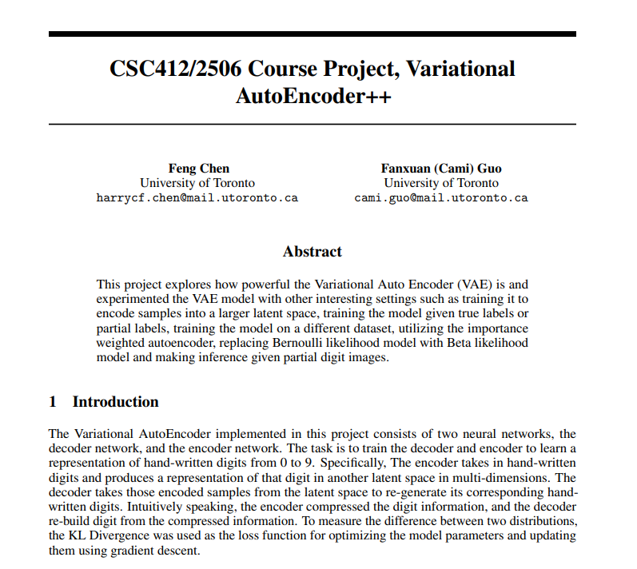

# Variational-AutoEncoder

Demo 
===========

See rest of the report: https://github.com/ShirSherbet/Variational-AutoEncoder/blob/main/project_report.pdf

Contributers:
==========
<table>
  <tr>
    <td align="center"><a href="https://github.com/ShirSherbet"> <b>Fanxuan Guo</b></a> 👀📖</td>
    <td align="center"><a href="https://github.com/harrychenfeng"> <b>Feng Chen</b></a> 👌🍕</td>
   </tr>
</table>
